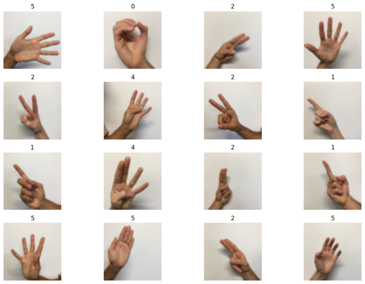

# Multi-Layer Perceptron for Image Classification

in this project i designed a mlp image classification AI to detect Sign Language numbers from 0 to 5

## Dataset

Sign languages (also known as signed languages) are languages that use manual communication to convey meaning. This can include simultaneously employing hand gestures, movement, orientation of the fingers, arms or body, and facial expressions to convey a speaker's ideas. [Source.](https://en.wikipedia.org/wiki/Sign_language)

The dataset that you'll be using during this assignment is a subset of the sign language digits. It contains six different classes representing the digits from 0 to 5. you can see some of the images below.

  

**Problem Statement:** We are given two dataset `train_signs.h5` and `test_signs.h5` containing:

    -- a training/test set of images labelled as one of the classes in {0, 1, 2, 3, 4, 5}.
    -- each image is of shape (64, 64, 3) where 3 is for the 3 channels (RGB).
    -- train a MLP model to classify the test images.
    

